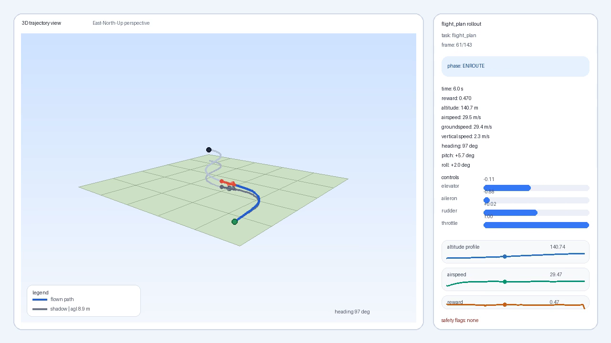
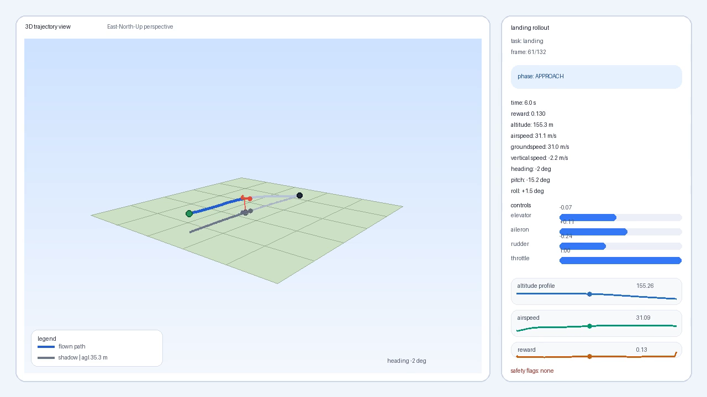
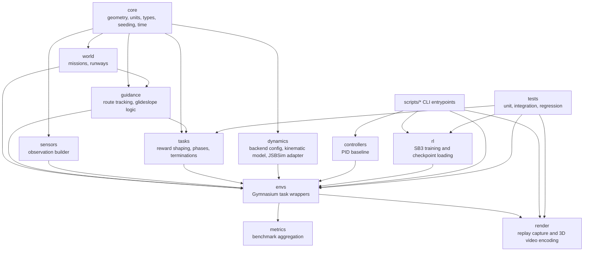
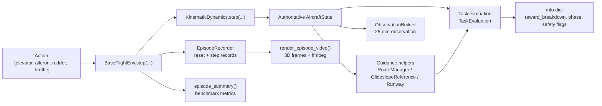
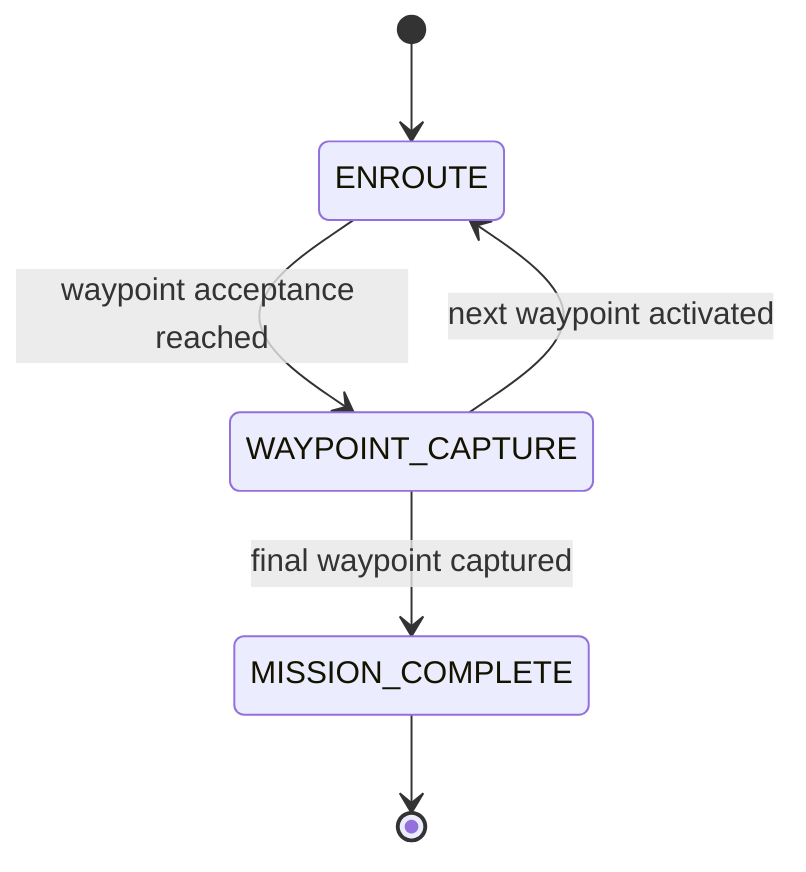
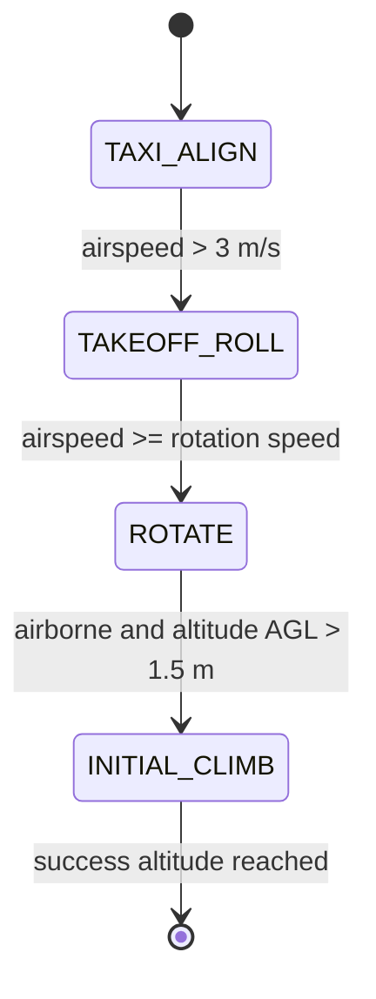
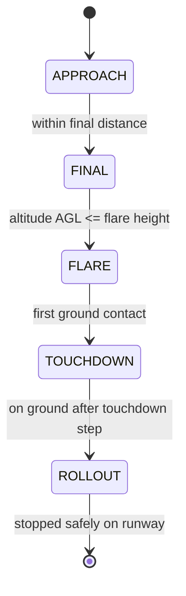
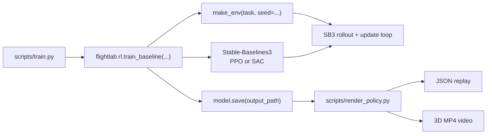
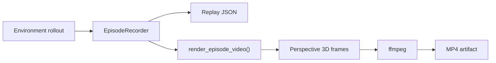

# flightlab-rl

`flightlab-rl` is a macOS-first fixed-wing aircraft simulation and reinforcement learning lab for benchmarking classical control and RL on takeoff, landing, and flight-plan-following tasks.

The repository is deliberately headless-first. The flight dynamics backend owns the authoritative aircraft state; environments, task logic, metrics, controllers, training hooks, and rendering all sit downstream of that state.

This repo is not a game engine. It is a compact research and engineering platform for:

- fixed-wing control
- runway and route guidance
- explicit task-phase logic
- deterministic rollouts
- benchmark-style evaluation
- fast local RL iteration

## Snapshot Gallery

The screenshots below were extracted from the current generated rollout videos in `replays/`.

| Takeoff | Flight Plan | Landing |
| --- | --- | --- |
|  |  |  |
| Corrected PPO takeoff rollout with positive climb and successful initial climb. | PPO flight-plan rollout in the 3D renderer. | PPO landing rollout in the 3D renderer. Useful for visualization, but landing is still the hardest task and not yet consistently solved. |

## What The Repo Already Does

| Capability | Status | Primary Modules |
| --- | --- | --- |
| Deterministic headless flight dynamics backend | Implemented | `src/flightlab/dynamics` |
| Gymnasium environments for `flight_plan`, `takeoff`, `landing` | Implemented | `src/flightlab/envs` |
| Explicit task phases and decomposed reward shaping | Implemented | `src/flightlab/tasks` |
| Route, runway, and glideslope guidance | Implemented | `src/flightlab/guidance`, `src/flightlab/world` |
| PID baseline controller | Implemented | `src/flightlab/controllers/pid.py` |
| PPO and SAC training hooks via Stable-Baselines3 | Implemented | `src/flightlab/rl` |
| Replay capture to JSON | Implemented | `src/flightlab/render/replay.py` |
| 3D-perspective MP4 rendering from replay | Implemented | `src/flightlab/render/video.py` |
| Benchmark aggregation and per-episode metrics | Implemented | `src/flightlab/metrics/benchmark.py` |
| JSBSim adapter surface | Implemented as optional backend hook | `src/flightlab/dynamics/jsbsim_adapter.py` |

## Quick Start

### Recommended Setup

```bash
uv venv
source .venv/bin/activate
uv pip install -e '.[dev]'
```

Install extras as needed:

```bash
uv pip install -e '.[dev,rl]'
uv pip install -e '.[dev,sim]'
uv pip install -e '.[dev,rl,sim]'
```

If you use `zsh`, keep the extras spec quoted like `'.[dev,rl,sim]'` or escape the brackets. Otherwise the shell will expand them before `uv` sees the argument.

### Video Rendering Requirement

MP4 rendering uses `ffmpeg` for encoding:

```bash
brew install ffmpeg
```

### Interpreter Note

Use the repository virtualenv explicitly in commands:

```bash
./.venv/bin/python scripts/benchmark.py --task flight_plan --episodes 5 --seed 7
```

This avoids leaking in Conda or system packages and keeps the behavior reproducible.

### Quality Gate

```bash
./.venv/bin/ruff check .
./.venv/bin/ruff format --check .
./.venv/bin/pytest
```

## Common Workflows

| Goal | Command |
| --- | --- |
| Benchmark a task with a fixed action | `./.venv/bin/python scripts/benchmark.py --task flight_plan --episodes 5 --seed 7` |
| Evaluate the PID baseline | `./.venv/bin/python scripts/eval.py --task flight_plan --seed 42 --steps 250` |
| Print live textual state traces | `./.venv/bin/python scripts/play.py --task takeoff --seed 42 --steps 120` |
| Export replay JSON | `./.venv/bin/python scripts/export_replay.py --task landing --seed 42 --steps 180 --output replays/landing.json` |
| Render replay JSON to MP4 | `./.venv/bin/python scripts/render_replay.py --replay replays/landing.json --output replays/landing.mp4` |
| Train an RL policy | `./.venv/bin/python scripts/train.py --algorithm ppo --task flight_plan --timesteps 300000 --seed 42 --output artifacts/ppo_flight_plan_seed42` |
| Train with reward logging and plots | `./.venv/bin/python scripts/train.py --algorithm sac --task takeoff --timesteps 120000 --seed 42 --output artifacts/takeoff_sac_seed42 --log-dir artifacts/training_plots/sac_takeoff_seed42 --plot-training --eval-episodes 10` |
| Render a trained checkpoint | `./.venv/bin/python scripts/render_policy.py --algorithm ppo --task takeoff --model artifacts/ppo_takeoff_seed42_v3 --seed 42 --steps 400 --video-output replays/takeoff_ppo_seed42_v3.mp4` |

## Architecture Overview

### Modularization Diagram



### Package Responsibilities

| Package | Purpose | Representative Files |
| --- | --- | --- |
| `src/flightlab/core` | Shared math, types, units, seeding, timing | `types.py`, `geometry.py`, `seed.py` |
| `src/flightlab/dynamics` | Backend abstraction plus deterministic kinematic backend | `base.py`, `kinematic.py`, `jsbsim_adapter.py` |
| `src/flightlab/envs` | Gymnasium-compatible task wrappers | `base.py`, `flight_plan.py`, `takeoff.py`, `landing.py` |
| `src/flightlab/tasks` | Reward shaping, terminations, explicit task phases | `flight_plan.py`, `takeoff.py`, `landing.py` |
| `src/flightlab/guidance` | Mission and approach logic | `route.py`, `approach.py` |
| `src/flightlab/controllers` | Classical control baselines | `pid.py` |
| `src/flightlab/sensors` | Observation vector generation | `observation.py` |
| `src/flightlab/world` | Mission and runway primitives | `mission.py`, `runway.py` |
| `src/flightlab/render` | Replay recording and 3D video rendering | `replay.py`, `video.py` |
| `src/flightlab/rl` | Stable-Baselines3 integration | `baselines.py` |
| `src/flightlab/metrics` | Episode summary aggregation | `benchmark.py` |

## End-To-End Runtime Flow



### Key Design Rule

The authoritative state is always produced by the dynamics backend. The renderer never mutates state, the tasks never integrate physics, and the RL wrapper never reimplements the flight model.

## Environment Interface

All tasks use the standard Gymnasium interaction pattern:

```python
obs, info = env.reset(seed=42)
obs, reward, terminated, truncated, info = env.step(action)
```

### Action Space

The action vector is always 4-dimensional and normalized:

| Index | Control | Range |
| --- | --- | --- |
| `0` | `elevator` | `[-1.0, 1.0]` |
| `1` | `aileron` | `[-1.0, 1.0]` |
| `2` | `rudder` | `[-1.0, 1.0]` |
| `3` | `throttle` | `[0.0, 1.0]` |

### Observation Space

The default observation vector is 25-dimensional.

## RL Training Artifacts

`scripts/train.py` can now write structured training artifacts directly from the main training path instead of requiring ad hoc notebook code.

Example:

```bash
./.venv/bin/python scripts/train.py \
  --algorithm ppo \
  --task flight_plan \
  --timesteps 300000 \
  --seed 42 \
  --output artifacts/ppo_flight_plan_seed42 \
  --log-dir artifacts/training_plots/ppo_flight_plan_seed42 \
  --plot-training \
  --eval-episodes 10
```

When `--log-dir` is provided, the training run writes:

- `monitor.csv`: Stable-Baselines3 monitor log with episode reward and length
- `summary.json`: compact run summary with final reward statistics and optional deterministic evaluation metrics
- `training.png`: reward-per-episode and moving-average plots when `--plot-training` is enabled

If `--plot-training` or `--eval-episodes` is used without `--log-dir`, the trainer derives a default artifact directory under `artifacts/`.

This makes it straightforward to compare PPO and SAC using the same task, seed, and logging format.

Base dynamic features:

| Features |
| --- |
| `u_mps`, `v_mps`, `w_mps` |
| `p_radps`, `q_radps`, `r_radps` |
| `roll_rad`, `pitch_rad` |
| `sin_heading`, `cos_heading` |
| `altitude_msl_m`, `vertical_speed_mps` |
| `airspeed_mps`, `groundspeed_mps` |
| `angle_of_attack_rad`, `sideslip_rad` |
| `throttle`, `elevator`, `aileron`, `rudder` |

Task-relative features:

| Features |
| --- |
| `task_delta_x_m` |
| `task_delta_y_m` |
| `task_delta_altitude_m` |
| `task_target_speed_error_mps` |
| `altitude_agl_m` |

### Standard `info` Payload

Each step exposes a common debugging and benchmarking payload:

- `reward`
- `reward_breakdown`
- `task_phase`
- `safety_flags`
- `stall_risk`
- `cross_track_error_m`
- `altitude_error_m`
- `touchdown_metrics` when applicable
- `success`

At episode end, `episode_summary` is included and contains:

- `success`
- `crash`
- `stall`
- `runway_excursion`
- `average_cross_track_error_m`
- `altitude_rmse_m`
- `action_smoothness`
- `episode_return`
- `completion_time_s`

## Built-In Tasks

### `flight_plan`

The aircraft follows an ordered 3D waypoint mission loaded from `Mission` and tracked by `RouteManager`.



Core ideas:

- the target waypoint carries both altitude and target airspeed
- cross-track error is computed against the active route segment, not only point-to-point distance
- mission completion is explicit and becomes the success condition

### `takeoff`

The aircraft starts on the runway and must accelerate, rotate, lift off, and reach an initial climb altitude safely.



Core ideas:

- runway alignment and heading still matter during the roll
- rotation is no longer optional after reaching the rotation window
- failing to lift off after overspeed is now an explicit failure mode
- climb and vertical speed are both rewarded after rotation

### `landing`

The aircraft starts on approach and must track the runway and glideslope, flare, touch down safely, and roll out to a stop on centerline.



Core ideas:

- glideslope is modeled as a constant-angle reference
- touchdown sink rate is captured before the dynamics clamps vertical speed on ground contact
- rollout success depends on stopping on the runway while maintaining lateral containment

## CLI Workflows In Detail

### Benchmark

Runs repeated episodes with a simple fixed action policy:

```bash
./.venv/bin/python scripts/benchmark.py --task flight_plan --episodes 5 --seed 7
./.venv/bin/python scripts/benchmark.py --task takeoff --episodes 5 --seed 7
./.venv/bin/python scripts/benchmark.py --task landing --episodes 5 --seed 7
```

### PID Evaluation

Runs the built-in classical controller:

```bash
./.venv/bin/python scripts/eval.py --task flight_plan --seed 42 --steps 250
./.venv/bin/python scripts/eval.py --task takeoff --seed 42 --steps 250
./.venv/bin/python scripts/eval.py --task landing --seed 42 --steps 250
```

Render the same controller rollout to MP4:

```bash
./.venv/bin/python scripts/eval.py --task flight_plan --seed 42 --steps 250 --video-output replays/flight_plan_pid.mp4
```

### Live Trace Playback

Prints one compact render line per step:

```bash
./.venv/bin/python scripts/play.py --task flight_plan --seed 42 --steps 100
```

Example line:

```text
time=3.2s task=flight_plan phase=ENROUTE pos=(145.2,-11.8,138.4) speed=25.1 reward=0.214
```

### Replay Export

Exports a deterministic JSON replay and optionally renders a video in the same run:

```bash
./.venv/bin/python scripts/export_replay.py --task takeoff --seed 42 --steps 120 --output replays/takeoff.json --video-output replays/takeoff.mp4
```

### Replay Rendering

Turns an existing replay JSON file into MP4:

```bash
./.venv/bin/python scripts/render_replay.py --replay replays/takeoff.json --output replays/takeoff.mp4
```

## RL Pipeline

### High-Level Training Flow



### Supported Algorithms

- `ppo`
- `sac`

Install the RL extra first:

```bash
uv pip install --python .venv/bin/python -e '.[dev,rl]'
```

### Recommended Training Commands

The following budgets are good starting points for the current headless backend:

```bash
./.venv/bin/python scripts/train.py --algorithm ppo --task flight_plan --timesteps 300000 --seed 42 --output artifacts/ppo_flight_plan_seed42
./.venv/bin/python scripts/train.py --algorithm ppo --task takeoff --timesteps 150000 --seed 42 --output artifacts/ppo_takeoff_seed42_v2
./.venv/bin/python scripts/train.py --algorithm ppo --task landing --timesteps 300000 --seed 42 --output artifacts/ppo_landing_seed42
```

For continued training:

```bash
./.venv/bin/python - <<'PY'
from flightlab.envs import make_env
from stable_baselines3 import PPO

env = make_env("takeoff", seed=42)
model = PPO.load("artifacts/ppo_takeoff_seed42_v2", env=env)
model.learn(total_timesteps=150000)
model.save("artifacts/ppo_takeoff_seed42_v3")
PY
```

### Rendering a Trained Agent

```bash
./.venv/bin/python scripts/render_policy.py \
  --algorithm ppo \
  --task takeoff \
  --model artifacts/ppo_takeoff_seed42_v3 \
  --seed 42 \
  --steps 400 \
  --replay-output replays/takeoff_ppo_seed42_v3.json \
  --video-output replays/takeoff_ppo_seed42_v3.mp4 \
  --fps 12
```

### Current Training Posture

- `flight_plan` trains reasonably with PPO
- `takeoff` is now trainable with PPO after the corrected takeoff reward design
- `landing` remains the hardest task and still benefits from further reward and curriculum work
- the RL helpers use vanilla SB3 `MlpPolicy` models without custom feature extractors or wrappers like `VecNormalize`
- the current training entrypoint is intentionally minimal and optimized for fast local iteration

## Visualization And Replay Pipeline



The rendering stack currently supports:

- `env.render()` for compact textual traces
- `env.export_replay(...)` for JSON replay capture
- `env.export_video(...)` for direct MP4 rendering
- `scripts/render_replay.py` for replay-to-video conversion
- `scripts/render_policy.py` for checkpoint playback plus replay/video export

The current renderer is not an interactive simulator viewport. It is an offline 3D-perspective video renderer that projects:

- the flown 3D trajectory
- a ground-plane shadow
- a fixed cinematic camera
- an aircraft glyph using heading, pitch, and roll
- per-frame telemetry and charts in a sidebar

## Technical Appendix

### Appendix A: Component Inventory

| Area | Technical Role | Main Files |
| --- | --- | --- |
| Core types and math | Defines `AircraftState`, `ControlCommand`, geometry helpers, units, seeding | `src/flightlab/core/types.py`, `geometry.py`, `seed.py`, `units.py` |
| Dynamics backend | Propagates the authoritative state at fixed `dt_s` | `src/flightlab/dynamics/base.py`, `kinematic.py` |
| Environment shell | Owns Gymnasium reset/step semantics, replay recording, summaries | `src/flightlab/envs/base.py` |
| Task wrappers | Provide task-specific reset state, observation deltas, and evaluation calls | `src/flightlab/envs/flight_plan.py`, `takeoff.py`, `landing.py` |
| Guidance | Computes route progress and glideslope reference errors | `src/flightlab/guidance/route.py`, `approach.py` |
| World primitives | Defines missions, waypoints, and runway local coordinates | `src/flightlab/world/mission.py`, `runway.py` |
| Reward shaping | Converts state and guidance progress into `TaskEvaluation` | `src/flightlab/tasks/*.py` |
| Sensors | Builds the compact 25-dimensional observation vector | `src/flightlab/sensors/observation.py` |
| Classical control | Provides the deterministic PID baseline | `src/flightlab/controllers/pid.py` |
| RL integration | Creates SB3 models, trains them, saves checkpoints, loads classes | `src/flightlab/rl/baselines.py` |
| Rendering | Serializes replay records and converts them into 3D video | `src/flightlab/render/replay.py`, `video.py` |
| Metrics | Aggregates per-episode summaries into benchmark metrics | `src/flightlab/metrics/benchmark.py` |

### Appendix B: State, Action, And Observation Details

#### State Representation

`AircraftState` is a local East-North-Up state with:

- position: `position_x_m`, `position_y_m`, `altitude_m`
- attitude: `roll_rad`, `pitch_rad`, `heading_rad`
- body rates: `p_radps`, `q_radps`, `r_radps`
- translational velocity: `u_mps`, `v_mps`, `w_mps`
- derived speeds: `airspeed_mps`, `groundspeed_mps`, `vertical_speed_mps`
- aerodynamic indicators: `angle_of_attack_rad`, `sideslip_rad`
- control states: `throttle`, `elevator`, `aileron`, `rudder`
- contact/time state: `on_ground`, `time_s`

#### Action Semantics

The agent does not command forces directly. It commands normalized control surfaces and throttle. The dynamics backend then applies actuator lag and clips the commands into valid ranges.

#### Observation Design

The observation intentionally mixes:

- direct dynamic state
- trigonometric heading encoding via `sin_heading` and `cos_heading`
- task-relative errors
- the current control-state values

This keeps the policy input compact while still giving each task the error signals it needs.

### Appendix C: Deterministic Headless Dynamics

The default backend in `src/flightlab/dynamics/kinematic.py` is a compact deterministic model intended for rapid local iteration.

It currently implements:

1. First-order actuator lag using `actuator_tau_s`.
2. Speed dynamics based on throttle, drag, pitch-induced gravity loss, and nominal mass scaling.
3. Body-rate dynamics for roll, pitch, and yaw driven by normalized control inputs.
4. Heading-rate update using bank angle plus yaw-rate contribution.
5. Vertical channel logic using pitch and speed to produce climb command and vertical acceleration.
6. Ground contact handling:
   - lift-off only occurs above `lift_off_speed_mps` and above a minimum pitch threshold
   - on-ground states clamp altitude back to runway elevation
   - landing transitions back to `on_ground=True` when altitude returns to runway elevation
7. Horizontal motion using heading plus optional steady wind components.
8. Angle-of-attack and sideslip estimates derived from pitch, flight-path angle, rudder, and wind.

Important implications:

- the backend is intentionally simple and fast
- it is deterministic given the same reset seed and action sequence
- it is suitable for reward-design work, regression tests, and baseline RL integration
- it should not be confused with a high-fidelity aircraft model

### Appendix D: Guidance And World Models

#### Route Guidance

`RouteManager` tracks the active waypoint in a `Mission` and computes:

- distance to waypoint
- cross-track error relative to the active segment
- altitude error to the active waypoint
- speed error to the active waypoint target speed
- desired track angle
- waypoint completion and mission completion flags

#### Runway Geometry

`Runway.local_coordinates(...)` converts world position into:

- along-track distance
- lateral deviation

This is reused by both takeoff and landing tasks for centerline logic and runway-bound checks.

#### Glideslope Reference

`GlideslopeReference` defines a constant-angle approach model:

- `target_altitude_m(along_track_m)` gives the target approach altitude
- `altitude_error_m(along_track_m, altitude_m)` gives glide-path deviation

### Appendix E: Reward Shaping And Terminations

Reward shaping is explicit and task-specific. Each task returns a `TaskEvaluation` with:

- scalar reward
- task phase
- reward breakdown dictionary
- success flag
- termination flag
- safety flags
- metrics used by the env summary and benchmarks

#### Flight Plan Reward Structure

`src/flightlab/tasks/flight_plan.py` combines:

| Component | Weight or Value |
| --- | --- |
| `cross_track` | `0.24` |
| `altitude` | `0.22` |
| `speed` | `0.18` |
| `heading` | `0.16` |
| `smoothness` | `0.10` |
| `waypoint_bonus` | `0.5` |
| `completion_bonus` | `2.0` |
| `safety` | additive negative penalty |

Terminates on:

- mission completion
- envelope violation

#### Takeoff Reward Structure

`src/flightlab/tasks/takeoff.py` now combines:

| Component | Weight or Role |
| --- | --- |
| `centerline` | `0.20` |
| `heading` | `0.15` |
| `speed_buildup` | `0.15` |
| `rotation` | `0.15` |
| `climb` | `0.20` |
| `vertical_climb` | `0.15` |
| `delayed_rotation` | additive negative penalty after entering the rotation window without climbing |
| `safety` | additive negative penalty |

Safety logic includes:

- runway excursion
- over-rotation near the ground
- envelope violation
- crash
- failed liftoff after overspeed while still on the runway

Success requires:

- `INITIAL_CLIMB` phase
- altitude AGL above the success target
- acceptable lateral deviation
- acceptable runway heading alignment

#### Landing Reward Structure

`src/flightlab/tasks/landing.py` combines:

| Component | Weight or Role |
| --- | --- |
| `alignment` | `0.22` |
| `glideslope` | `0.22` |
| `stability` | `0.16` |
| `flare` | `0.12` |
| `touchdown` | `0.16` |
| `rollout` | `0.12` |
| `safety` | additive negative penalty |

Safety logic includes:

- runway excursion
- hard landing via touchdown sink rate
- envelope violation
- crash during rollout or touchdown

Success requires:

- `ROLLOUT` phase
- groundspeed below the stop threshold
- still on the runway
- lateral deviation within the rollout tolerance

### Appendix F: Benchmark Metrics

Per-episode summaries are built inside `BaseFlightEnv._episode_summary(...)` and then aggregated by `summarize_episodes(...)`.

The benchmark output contains:

- `success_rate`
- `crash_rate`
- `stall_rate`
- `runway_excursion_rate`
- `average_cross_track_error_m`
- `altitude_rmse_m`
- `average_action_smoothness`
- `average_return`
- `average_completion_time_s`

This makes the repo usable as a benchmark harness rather than only a training harness.

### Appendix G: RL Implementation Details

The RL entrypoint is intentionally thin:

1. `scripts/train.py` parses `--algorithm`, `--task`, `--timesteps`, `--seed`, `--output`.
2. `train_baseline(...)` in `src/flightlab/rl/baselines.py` resolves the SB3 class.
3. `make_env(task, seed=...)` constructs one built-in environment instance.
4. SB3 wraps the env with `Monitor` and `DummyVecEnv`.
5. `model.learn(total_timesteps=...)` runs the rollout/update loop.
6. If `--output` is provided, `model.save(...)` writes the checkpoint.

Current implementation notes:

- policies use default SB3 `MlpPolicy`
- the training helper seeds the env and the model
- the repo does not currently add callbacks, tensorboard logging, curriculum management, or vectorized multi-env training
- `scripts/render_policy.py` loads a saved model and runs deterministic inference by default
- `scripts/render_policy.py --stochastic` is available for stochastic rollout sampling

### Appendix H: Replay And Render Implementation

Replay records are written by `EpisodeRecorder` and contain:

- `kind`: `reset` or `step`
- serialized `state`
- `action` for step records
- `reward`
- the standardized `info` payload

The renderer in `src/flightlab/render/video.py` then:

1. prepares frames from replay records
2. computes scene bounds
3. constructs a fixed perspective camera
4. draws a ground plane and grid
5. projects the flown path and ground shadow
6. draws an aircraft glyph using heading, pitch, and roll
7. draws telemetry charts in the sidebar
8. streams raw frames to `ffmpeg` for H.264 MP4 encoding

### Appendix I: Config Surface

Example YAML config files live under `configs/`:

| Path | Meaning |
| --- | --- |
| `configs/aircraft/trainer.yaml` | nominal aircraft parameters |
| `configs/missions/traffic_pattern.yaml` | waypoint mission example |
| `configs/tasks/flight_plan.yaml` | flight-plan task settings |
| `configs/tasks/takeoff.yaml` | takeoff task settings |
| `configs/tasks/landing.yaml` | landing task settings |
| `configs/training/ppo.yaml` | PPO training defaults |
| `configs/training/sac.yaml` | SAC training defaults |
| `configs/weather/calm.yaml` | calm-weather example |
| `configs/world/default_runway.yaml` | runway geometry example |

The current scripts do not yet wire every YAML file directly into the runtime path, but the directory layout is already aligned with that architecture.

### Appendix J: Current Limitations And Good Next Extensions

Current limitations:

- no interactive viewer yet; rendering is currently offline replay-to-video
- no backend selector in the built-in scripts
- no vectorized or distributed RL training path
- no callback/checkpoint manager beyond direct `model.save(...)`
- no notebook or dashboard layer for replay analysis yet
- landing is still the least mature task from an RL-performance perspective

Good next steps:

- expose backend selection between kinematic and JSBSim
- add callback-driven periodic checkpointing and evaluation
- add tensorboard or structured experiment logging
- add a notebook or dashboard for replay and reward-component analysis
- add curriculum logic for landing stabilization

## Notes

The repo currently balances three priorities:

1. correctness and clear decomposition
2. reproducibility and deterministic rollouts
3. fast local iteration on reward shaping and RL wiring

That is why the current architecture keeps physics, task logic, controllers, metrics, and rendering separate even though the overall implementation stays intentionally compact.
