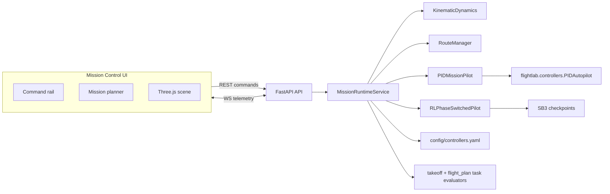

# Mission Control

`apps/mission-control` is a self-contained local ops room for `flightlab-rl`: a FastAPI backend that runs a live kinematic mission session and a React + Three.js frontend that lets one operator launch, monitor, and replan a single aircraft in real time.

The app is intentionally separate from the Gymnasium benchmark envs. It reuses the repo's simulation primitives, guidance code, PID baseline, and RL checkpoint loading, but it runs its own continuous session loop so route changes can be applied mid-flight without resetting an episode.

## Scope

V1 supports:

- one aircraft at a time
- deterministic kinematic backend only
- runway-ready spawn
- `pid` and `rl_phase_switched` controller modes
- operator-triggered takeoff
- live route replacement while airborne
- websocket telemetry and a 3D operator view

Out of scope in v1:

- landing workflow
- return-to-base automation
- multi-aircraft coordination
- JSBSim live runtime
- auth or multi-user state

## Layout

```text
apps/mission-control/
  README.md
  docker-compose.yml
  config/
    controllers.yaml
  api/
    Dockerfile
    requirements.txt
    app/
      main.py
      session.py
      controllers.py
      config.py
      schemas.py
    tests/
  web/
    Dockerfile
    README.md
    package.json
    src/
```

## Architecture



## Backend Behavior

The backend owns the authoritative live state.

- simulation tick: `20 Hz`
- telemetry broadcast: `10 Hz`
- phases: `standby`, `takeoff_roll`, `climb_out`, `enroute`, `paused`, `completed`, `failed`
- start state: runway threshold, aligned with heading, on ground

### REST and WebSocket API

- `GET /api/session`
- `GET /api/controllers`
- `POST /api/session/start`
- `POST /api/session/reset`
- `POST /api/commands/takeoff`
- `POST /api/commands/pause`
- `POST /api/commands/resume`
- `PUT /api/mission`
- `WS /ws/telemetry`

### Controller Modes

`pid`

- uses the repo PID autopilot with mission-control-specific takeoff logic
- holds runway heading during the roll
- rotates and climbs on a constrained pitch schedule
- switches to waypoint tracking after climb-out success

`rl_phase_switched`

- loads one takeoff checkpoint and one flight-plan checkpoint
- uses the takeoff model during `takeoff_roll` and `climb_out`
- switches to the flight-plan model after the same climb-out success condition used by the takeoff task
- rejects start if either checkpoint is missing
- only permits mission replans in `standby` or `enroute`

## Frontend Behavior

The web client is a local-first operator console with a military / surveillance visual language.

- left rail: session controls, controller selection, telemetry, recent errors
- center: tactical mission board with click-to-add and drag-to-move waypoints
- right pane: live 3D scene with orbit and chase cameras

Planner actions:

- click to add waypoints
- drag to move them
- edit altitude, speed, and acceptance radius
- reorder or delete from the route stack
- commit the full route as an immediate mission replacement

## Local Development

### One Command Launcher

The simplest way to start both services is:

```bash
python3 apps/mission-control/run.py
```

Or, from the repo root on macOS/Linux:

```bash
./apps/mission-control/run.py
```

That script:

- checks for the repo virtualenv and backend dependencies
- installs frontend `node_modules` automatically if needed
- starts the FastAPI backend on `8000`
- starts the Vite frontend on `5173`
- shuts both down together on `Ctrl-C`

This launcher uses your host Python environment, so if you installed the repo with `.[rl]`, the RL controller mode is available there too.

### Python Backend

From the repo root:

```bash
uv venv
source .venv/bin/activate
uv pip install -e '.[dev,rl]'
uv pip install -r apps/mission-control/api/requirements.txt
```

If you use `zsh`, keep the extras quoted exactly as shown above.

Run the backend:

```bash
cd apps/mission-control/api
../../../.venv/bin/uvicorn app.main:app --reload --host 0.0.0.0 --port 8000
```

### Web Frontend

```bash
cd apps/mission-control/web
npm install
npm run dev -- --host 0.0.0.0 --port 5173
```

The frontend proxies `/api` and `/ws` to `localhost:8000` in local development. To point it at another backend, set `VITE_MISSION_CONTROL_API_URL`.

## Docker Compose

From inside `apps/mission-control`:

```bash
docker compose up --build
```

Services:

- API: `http://localhost:8000`
- Web: `http://localhost:5173`

The compose stack mounts the repo into both containers so the API can import `flightlab` and resolve checkpoints from the local artifact tree.

Important:

- the Docker path is now intentionally CPU-only and lightweight by default
- it does not install the RL stack inside the API image
- this avoids large Linux `torch` / CUDA package downloads on macOS-hosted Docker
- inside Docker, `pid` mode works out of the box and `rl_phase_switched` will show as unavailable unless you extend the image with RL dependencies yourself

## Controller Registry

Controller selection is driven by [controllers.yaml](config/controllers.yaml).

The registry currently exposes:

- `pid`
- `rl_phase_switched`

The RL mode points at repo-local checkpoints relative to the registry file. To swap models, edit the registry paths and keep them relative to `apps/mission-control/config/controllers.yaml`.

Example:

```yaml
controllers:
  rl_phase_switched:
    takeoff_model_path: ../../../artifacts/ppo_takeoff_seed42_v3.zip
    flight_plan_model_path: ../../../artifacts/ppo_flight_plan_seed42.zip
```

## Verification

Backend:

```bash
cd apps/mission-control/api
../../../.venv/bin/pytest tests --no-cov
```

Frontend:

```bash
cd apps/mission-control/web
npm test
npm run build
```

## Known Limitations

- kinematic-only runtime
- no landing or rollout control surface in the UI
- no model upload flow; checkpoints are registry-driven only
- no persistence for missions or session history
- large frontend production bundle because the first cut prioritizes clarity over code-splitting
